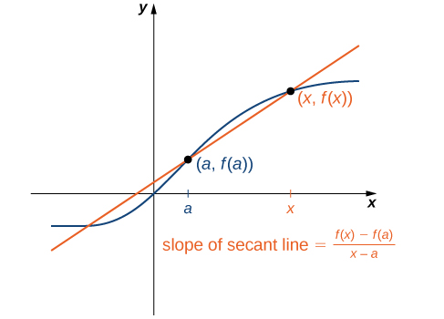
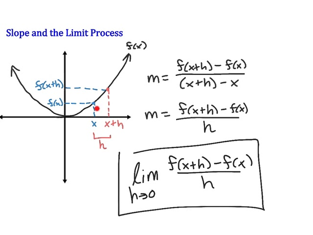

<!-- 

 -->

The derivative of $f(x)$

$$
f'(x) = \lim_{h \to 0} \frac{f(x + h) - f(x)}{h}
$$

This is the formal definition of a derivative

A limit is asking, as I get closer and closer to some point, what value do my function output values get closer and closer to

$x + h$ means, start at $x$ and nudge forward a tiny step $h$

As $h \rarr 0$, we're shrinking that nudge until it's basically empty

---

The **derivative** measures the instantaneous rate of change of a function, or rather, how steep the graph is at one point

Finding the derivative of $f(x) = x^2$

$$
f'(x) = \lim_{h \to 0} \frac{f(x + h) - f(x)}{h}
$$

$$
f'(x) = \lim_{h \to 0} \frac{(x + h)^2 - x^2}{h}
$$

$$
f'(x) = \lim_{h \to 0} \frac{(x^2 + 2xh + h^2) - x^2}{h}
$$

$$
f'(x) = \lim_{h \to 0} \frac{2xh + h^2}{h}
$$

$$
f'(x) = \lim_{h \to 0} 2x + h
$$

$$
f'(x) = 2x
$$

So the derivative of $x^2$ is $2x$, meaning the slope of the curve at each point $x$ is $2x$

---

Here are the limit laws for functions $f(x)$, $g(x)$, and constant $c$

**Constant Law**
$$\lim_{x \to a} c = c$$

Find the derivative of $f(x) = 5$

$$
f'(x) = \lim_{h \to 0} \frac{f(x + h) - f(x)}{h}
$$

$$
f'(x) = \lim_{h \to 0} \frac{5 - 5}{h}
$$

$$
f'(x) = \lim_{h \to 0} 0 \\[0.5em]
= 0
$$

The limit of a constant is just the constant itself, constants don't change. A constant's derivative is always 0

**Identity Law**

$$\lim_{x \to a} x = a$$

Find the derivative of $f(x) = x$

$$
f'(x) = \lim_{h \to 0} \frac{f(x + h) - f(x)}{h}
$$

$$
f'(x) = \lim_{h \to 0} \frac{(x + h) - x}{h}
$$

$$
f'(x) = \lim_{h \to 0} \frac{h}{h}
$$

$$
f'(x) = \lim_{h \to 0} 1 \\[0.5em]
= 1
$$

The slope of $f(x) = x$ is always 1

**Sum/Difference Law**

$$
\lim_{x \to a} [f(x) \pm g(x)] = \\[1em]
\lim f(x) \pm \lim g(x)
$$

Find the derivative of $f(x) = x^2 + x$

$$
f'(x) = \lim_{h \to 0} \frac{f(x + h) - f(x)}{h}
$$

$$
f'(x) = \lim_{h \to 0} \frac{[(x + h)^2 + (x + h)] - (x^2 + x)}{h}
$$

$$
f'(x) = \lim_{h \to 0} \frac{[(x^2 + 2xh + h^2) + (x + h)] - (x^2 + x)}{h}
$$

$$
f'(x) = \lim_{h \to 0} \frac{x^2 + 2xh + h^2 + x + h - x^2 - x}{h}
$$

$$
f'(x) = \lim_{h \to 0} \frac{2xh + h^2 + h}{h}
$$

$$
f'(x) = \lim_{h \to 0} 2x + h + 1 \\[1em]
= 2x + 1
$$

We can separate the limit of a sum/difference into the sum/difference of limits.

**Constant Multiple Law**

$$
\lim_{x \to a} [c \cdot f(x)] = \\[1em]
c \cdot \lim f(x)
$$

Find the derivative of $f(x) = 7x^2$

$$
f'(x) = \lim_{h \to 0} \frac{f(x + h) - f(x)}{h}
$$

$$
f'(x) = \lim_{h \to 0} \frac{7(x + h)^2 - 7x^2}{h}
$$

$$
f'(x) = \lim_{h \to 0} \frac{7[(x + h)^2 - x^2]}{h}
$$

$$
f'(x) = 7 \cdot \lim_{h \to 0} \frac{(x + h)^2 - x^2}{h}
$$

$$
f'(x) = 7 \cdot \lim_{h \to 0} \frac{2xh + h^2}{h}
$$

$$
f'(x) = 7 \cdot \lim_{h \to 0} 2x + h
$$

$$
f'(x) = 7 \cdot 2x \\[1em]
= 14x
$$

We can "pull out" constants from a limit

**Product Law**

$$
\lim_{x \to a} [f(x)g(x)] = \\[1em]
(\lim f(x))(\lim g(x))
$$

Find the derivative of $f(x) = x^2 \cdot x$

$$
f'(x) = \lim_{h \to 0} \frac{f(x + h) - f(x)}{h}
$$

$$
f'(x) = \lim_{h \to 0} \frac{(x + h)^3 - x^3}{h}
$$

$$
f'(x) = \lim_{h \to 0} \frac{(x^3 + 3x^2h + 3xh^2 + h^3) - x^3}{h}
$$

$$
f'(x) = \lim_{h \to 0} \frac{3x^2h + 3xh^2 + h^3}{h}
$$

$$
f'(x) = \lim_{h \to 0} 3x^2 + 3xh + h^2
$$

$$
f'(x) = \lim_{h \to 0} 3x^2 + 0 + 0 \\[1em]
= 3x^2
$$

We can separate the limit of a product into the product of limits

**Quotient Law**

$$
\lim_{x \to a} \frac{f(x)}{g(x)} = \\[1em]
\frac{\lim f(x)}{\lim g(x)}, \qquad g(x) \ne 0
$$

Find the derivative of $f(x) = \frac{1}{x}$

$$
f'(x) = \lim_{h \to 0} \frac{f(x + h) - f(x)}{h}
$$

$$
f'(x) = \lim_{h \to 0} \frac{\frac{1}{x + h} - \frac{1}{x}}{h}
$$

$$
f'(x) = \lim_{h \to 0} \frac{\frac{x - (x + h)}{x(x + h)}}{h}
$$

$$
f'(x) = \lim_{h \to 0} \frac{-h}{h \cdot x(x + h)}
$$

$$
f'(x) = \lim_{h \to 0} \frac{-1}{x(x + h)} \\[1em]
= \frac{-1}{x^2}
$$

We can separate the limit of a quotient into the quotient of limits

**Power Law**

$$
\lim_{x \to a} [f(x)]^n = (\lim f(x))^n
$$

Find the derivative of $f(x) = x^4$

$$
f'(x) = \lim_{h \to 0} \frac{f(x + h) - f(x)}{h}
$$

$$
f'(x) = \lim_{h \to 0} \frac{(x + h)^4 - x^4}{h}
$$

$$
f'(x) = \lim_{h \to 0} \frac{(x^4 + 4x^3h + 6x^2h^2 + 4xh^3 + h^4 - x^4)}{h}
$$

$$
f'(x) = \lim_{h \to 0} \frac{(4x^3h + 6x^2h^2 + 4xh^3 + h^4)}{h}
$$

$$
f'(x) = \lim_{h \to 0} 4x^3 + 6x^2h + 4xh^2 + h^3 \\[1em]
= 4x^3
$$

We can take the limit inside a power

**Root Law**

$$
\lim_{x \to a} \sqrt[n]{f(x)} = \\[1em]
\sqrt[n]{\lim f(x)}
$$

Find the derivative of $f(x) = \sqrt{x}$

$$
f'(x) = \lim_{h \to 0} \frac{f(x + h) - f(x)}{h}
$$

$$
f'(x) = \lim_{h \to 0} \frac{\sqrt{x + h} - \sqrt{x}}{h}
$$

$$
f'(x) = \lim_{h \to 0} \frac{(\sqrt{x + h} - \sqrt{x})(\sqrt{x + h} + \sqrt{x})}{h(\sqrt{x + h} + \sqrt{x})}
$$

$$
f'(x) = \lim_{h \to 0} \frac{(x + h) - x}{h(\sqrt{x + h} + \sqrt{x})}
$$

$$
f'(x) = \lim_{h \to 0} \frac{h}{h(\sqrt{x + h} + \sqrt{x})}
$$

$$
f'(x) = \lim_{h \to 0} \frac{1}{\sqrt{x + h} + \sqrt{x}}
$$

$$
f'(x) = \lim_{h \to 0} \frac{1}{2\sqrt{x}} \\[1em]
= \frac{1}{2\sqrt{x}}
$$

We can take the limit inside a root (as long as the root is defined)

**Composition Law (Continuity)**

$$
\lim_{x \to a} f(g(x)) = \\[1em]
f(\lim_{x \to a} g(x))
$$

Find the derivative of $f(x) = e^x$

$$
f'(x) = \lim_{h \to 0} \frac{f(x + h) - f(x)}{h}
$$

$$
f'(x) = \lim_{h \to 0} \frac{e^{x + h} - e^x}{h}
$$

$$
f'(x) = \lim_{h \to 0} \frac{e^x \cdot e^h - e^x}{h}
$$

$$
f'(x) = e^x \cdot \lim_{h \to 0} \frac{e^h -1}{h}
$$

$$
f'(x) = e^x \cdot 1 \\[1em]
= e^x
$$

Note that, $\lim_{h \to 0} \frac{e^h -1}{h}$, is a known special limit that equals 1

If $f$ is continuous, we can move the limit inside the function

---

So far, every derivative has looked like,

$$
f'(x) = \lim_{h \to 0} \frac{f(x + h) - f(x)}{h}
$$

This is verbose, so instead we have a symbol that means, "take the derivative of this funcition with respect to x"

This symbol is:

$$
\frac{d}{dx}
$$

It's an operator, you feed it a function, it outputs a derivative

Find the derivative of $f(x) = x$

$$
f'(x) = 1 \\[1em]
\frac{d}{dx}(x) = 1
$$

$dx =$ "an infinitesimally small change in $x$
$dy =$ "the corresponding infinitesimal change in $y = f(x)$"

The derivative is their ratio:

$$
  \frac{dy}{dx} = \lim_{h \to 0} \frac{f(x + h) - f(x)}{h}
$$

So it encodes the slope idea naturally, rise over run, but at the instantaneous scale

---

Here are the rules for derivatives, they are abstractions based on the limit laws

**Constant Rule**

$$
\frac{d}{dx} [c] = 0 
$$

_*Example*_

$$
\frac{d}{dx} [7] = 0
$$

_*Why:*_ The slope of a horizontal line is 0
\
**Identity Rule**

$$
\frac{d}{dx} [x] = 1
$$

_*Example*_

$$
\frac{d}{dx} [x] = 1
$$

_*Why:*_ The line $y = x$ rises 1 unit for every 1 unit run
\
**Constant Multiple Rule**

$$
\frac{d}{dx} [c \cdot f(x)] = \\[1em]
c \cdot f'(x)
$$

_*Example*_

$$
\frac{d}{dx} [5x^2] = \\[1em]
5 \cdot \frac{d}{dx} [x^2] = \\[1em]
5(2x) = \\[1em]
10x
$$

_*Why:*_ Multiplying a function by a constant just scales its slope

**Sum/Difference Rule**

$$
\frac{d}{dx} [f(x) \pm g(x)] = \\[1em]
f'(x) \pm g'(x)
$$

_*Example*_

$$
\frac{d}{dx} [x^2 + \sin(x)] = \\[1em]
\frac{d}{dx} [x^2] + \frac{d}{dx} [\sin(x)] = \\[1em]
2x + \cos(x)
$$

_*Why:*_ Slopes of sums are just sums of slopes

**Power Rule**

$$
\frac{d}{dx} [x^n] = nx^{n - 1}, \qquad (n \in \mathbb{R})
$$

_*Example*_

$$
\frac{d}{dx} [x^4] = 4x^3
$$

_*Why:*_ Derived from binomial expansion + limit definition; it generalizes binomial slopes

**Product Rule**

$$
\frac{d}{dx} [f(x)g(x)] = \\[1em]
f'(x)g(x) + f(x)g'(x)
$$

_*Example*_

$$
\frac{d}{dx} [x \sin(x)] = \\[1em]
(1)(\sin(x)) + (x)(\cos(x)) = \\[1em]
\sin(x) + x \cos(x)
$$

_*Why:*_ The slope of a product isn't just the product of slops, both factors can change at once, so both contributions matter

**Quotient Rule**

$$
\frac{d}{dx} \left[ \frac{f(x)}{g(x)} \right] = \frac{f'(x)g(x) - f(x)g'(x)}{[g(x)]^2}, \qquad g(x) \ne 0
$$

_*Example*_

$$
\frac{d}{dx} \left[ \frac{x}{\cos(x)} \right] = \\[1em]
\frac{(1)(\cos(x)) - (x)(-\sin(x))}{\cos^2(x)} = \\[1em]
\frac{\cos(x) + x \sin(x)}{\cos^2(x)}
$$

_*Why:*_ Denominator changing complicates things, we adjust slope by subtracting the "top times slope of bottom"

**Chain Rule**

$$
\frac{d}{dx} [f(g(x))] = \\[1em]
f'(g(x)) \cdot g'(x)
$$

_*Example*_

$$
\frac{d}{dx} [\sin(x^2)] = \\[1em]
\cos(x^2) \cdot (2x) = \\[1em]
2x \cos(x^2)
$$

_*Why:*_ In a "function inside a function," slope propagates through both layers, think of gears turning inside gears

**Exponential Rule**

$$
\frac{d}{dx} [e^x] = e^x
$$

_*Example*_

$$
\frac{d}{dx} [e^x] = e^x
$$

_*Why:*_ Unique property of the natural exponential, it's its own slope

**Logarithm Rule**

$$
\frac{d}{dx} [\ln(x)] = \frac{1}{x}, \qquad x \gt 0
$$

_*Example*_

$$
\frac{d}{dx} [\ln(5x)] = \\[1em]
\frac{1}{5x} \cdot 5 = \\[1em]
\frac{1}{x}
$$

_*Why:*_ Logarithms measure growth rates, and slope diminshes as $x$ grows

**Trigonometric Rules**

$$
\frac{d}{dx} [\sin(x)] = \cos(x) \\[1em]
\frac{d}{dx} [\cos(x)] = -\sin(x) \\[1em]
\frac{d}{dx} [\tan(x)] = \sec^2(x)
$$

_*Example*_

$$
\frac{d}{dx}[\tan(x)] = \sec^2(x)
$$

_*Why:*_ These follow from limit definitions + trig identities

**In summary,**
with the derivative operator,
  - Constants $\rarr$ vanish
  - $x^n$ $\rarr$ power rule
  - Sums, multiples $\rarr$ distribute nicely
  - Products/quotients $\rarr$ special rules
  - Chains $\rarr$ multiply slopes inside and out
  - Special functions (exp, log, trig) $\rarr$ each has a formula

---

**Examples**

_**Polynomial**_

Find $\frac{d}{dx} (3x^4 - 5x^2 + 7x - 12)$

Apply power rule term by term (sum/difference law)

$$
\frac{d}{dx} (3x^4) = 12x^3 \\[1em]
\frac{d}{dx} (-5x^2) = -10x \\[1em]
\frac{d}{dx} (7x) = 7 \\[1em]
\frac{d}{dx} (-12) = 0
$$

So,

$$
f'(x) = 12x^3 - 10x + 7
$$

_**Exponential**_

Find $\frac{d}{dx} (e^{2x})$

This is a chain rule problem: outer: $e^u$, inner: $u = 2x$

$$
\frac{d}{dx} (e^{2x}) = \\[1em]
e^{2x} \cdot \frac{d}{dx} (2x) = \\[1em]
e^{2x} \cdot 2 = \\[1em]
2e^{2x}
$$

So,

$$
f'(x) = 2e^{2x}
$$

_**Fraction**_

Find $\frac{d}{dx} \left( \frac{x^2 + 1}{x} \right)$

Use quotient rule:

$$
\frac{d}{dx} \left( \frac{f}{g} \right) = \frac{f'g - fg'}{g^2}
$$

Here,

$$
f(x) = x^2 + 1, \qquad g(x) = x \\[1em]
f'(x) = 2x, \qquad g'(x) = 1
$$

Therefore,

$$
\frac{d}{dx} \left( \frac{x^2 + 1}{x} \right) = \\[1em]
\frac{(2x)(x) - (x^2 + 1)(1)}{x^2} = \\[1em]
\frac{2x^2 - (x^2 + 1)}{x^2} = \\[1em]
\frac{2x^2 - x^2 - 1}{x^2} = \\[1em]
\frac{x^2 - 1}{x^2}
$$

So,

$$
f'(x) = \frac{x^2 - 1}{x^2}
$$

_**Square Root**_

Find $\frac{d}{dx}(\sqrt{x^2 + 4})$

This is a chain rule problem: outer: $\sqrt{u} = u^{1/2}$, inner: $u = x^2 + 4$

$$
\frac{d}{dx}(\sqrt{x^2 + 4}) = \\[1em]
\frac{1}{2\sqrt{x^2 + 4}} \cdot \frac{d}{dx} (x^2 + 4) = \\[1em]
\frac{1}{2 \sqrt{x^2 + 4}} \cdot (2x) = \\[1em]
\frac{x}{\sqrt{x^2 + 4}}
$$

So,

$$
f'(x) = \frac{x}{\sqrt{x^2 + 4}}
$$

_**Mixed Polynomial + Exponential**_

Find $\frac{d}{dx} (x^3 e^x)$

This a product rule problem: $f = x^3$, $g = e^x$

$$
(fg)' = f'g + fg'
$$

Here,

$$
f'(x) = 3x^2 \\[1em]
g'(x) = e^x
$$

Therefore,

$$
\frac{d}{dx} (x^3e^x) = \\[1em]
(3x^2)(e^x) + (x^3)(e^x) = \\[1em]
e^x(3x^2 + x^3)
$$

So,

$$
(fg)' = e^x(3x^2 + x^3)
$$

_**Rational Power**_

Find $\frac{d}{dx} (x^{3 / 2})$

Use power rule for fractional exponents

$$
\frac{d}{dx} (x^{3 / 2}) = \\[1em]
\frac{3}{2} x^{1 / 2} = \\[1em]
\frac{3}{2} \sqrt{x}
$$

So,

$$
f'(x) = \frac{3}{2} \sqrt{x}
$$

---

