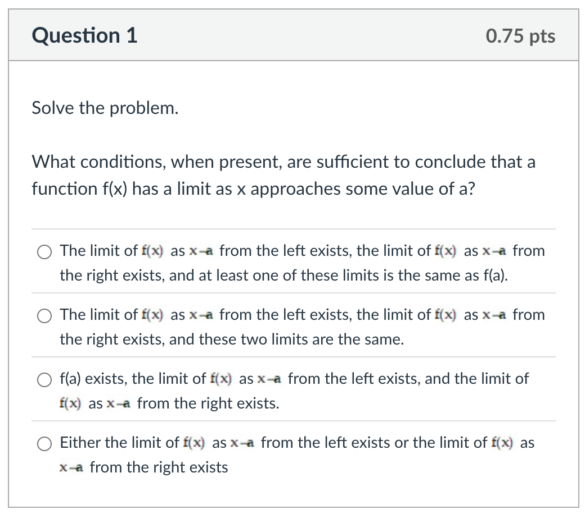
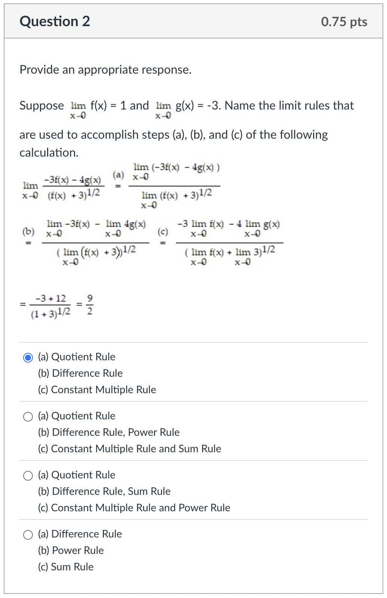
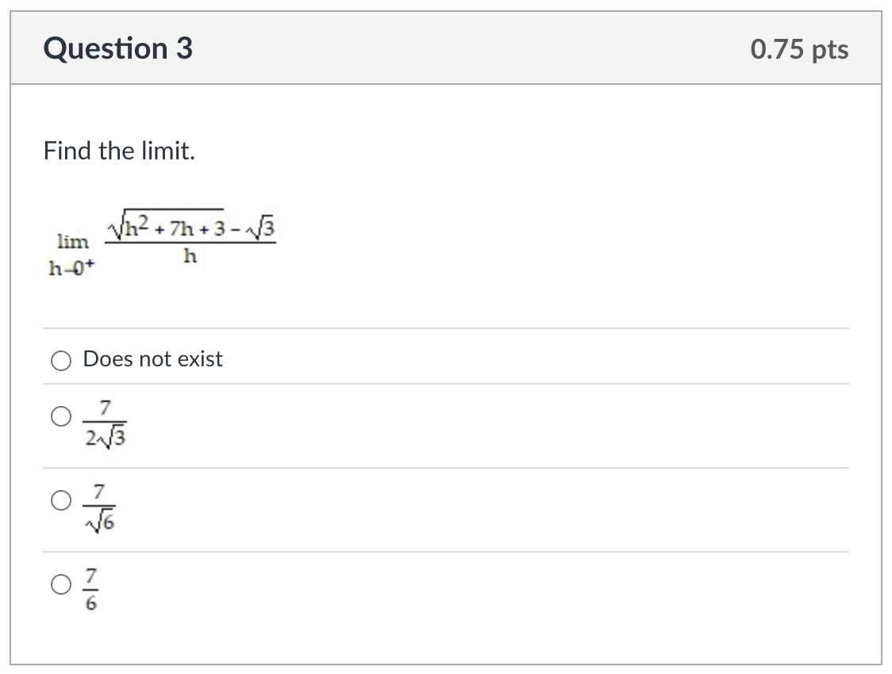
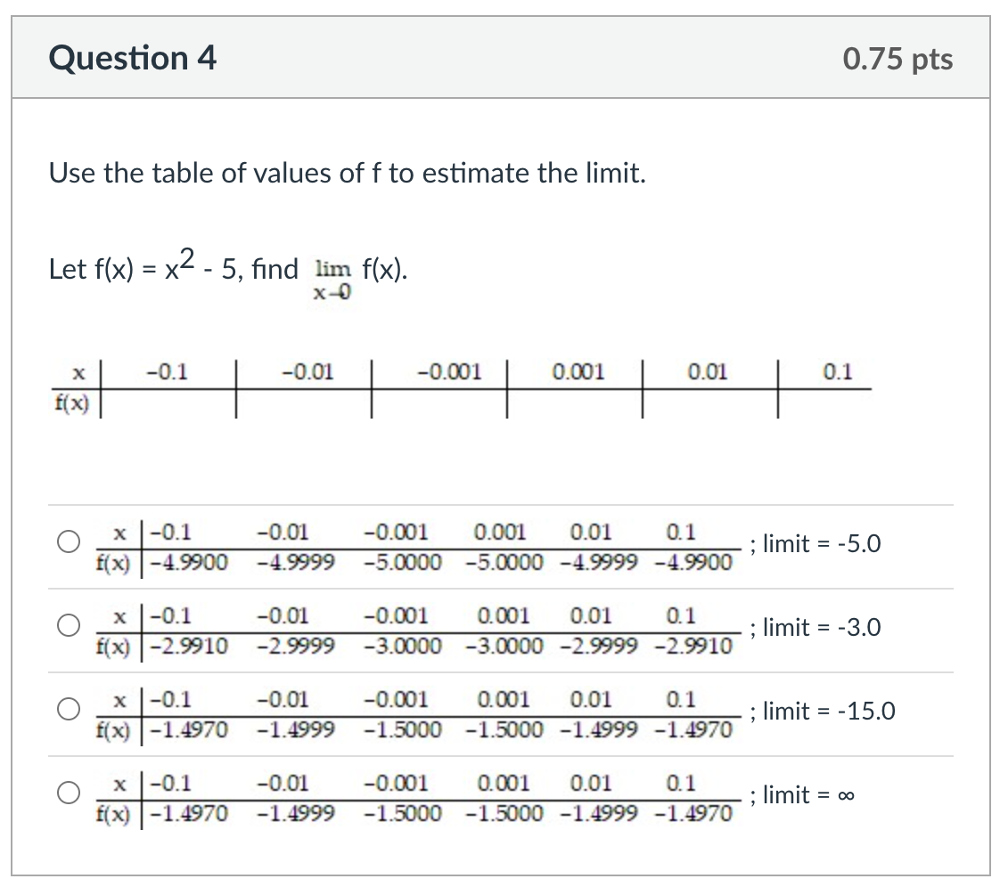
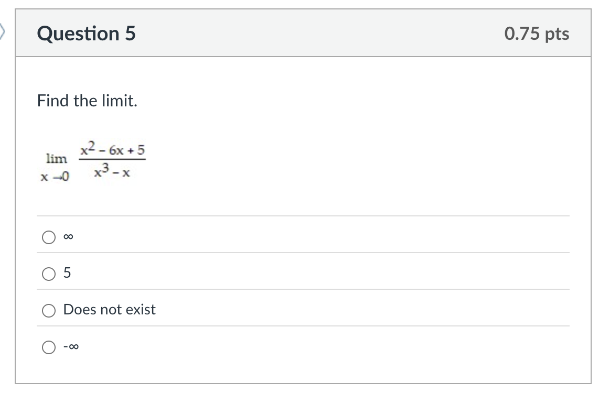
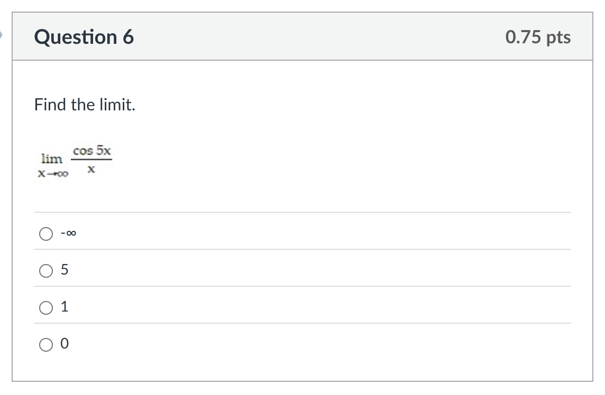
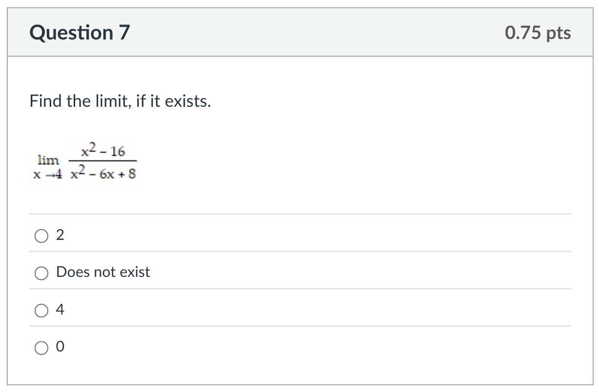
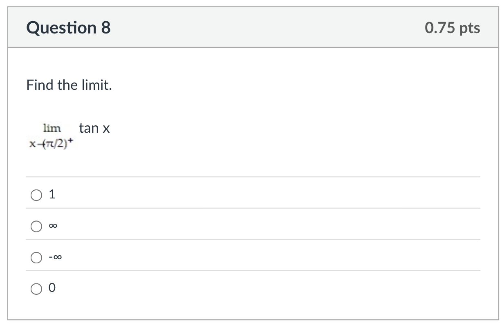
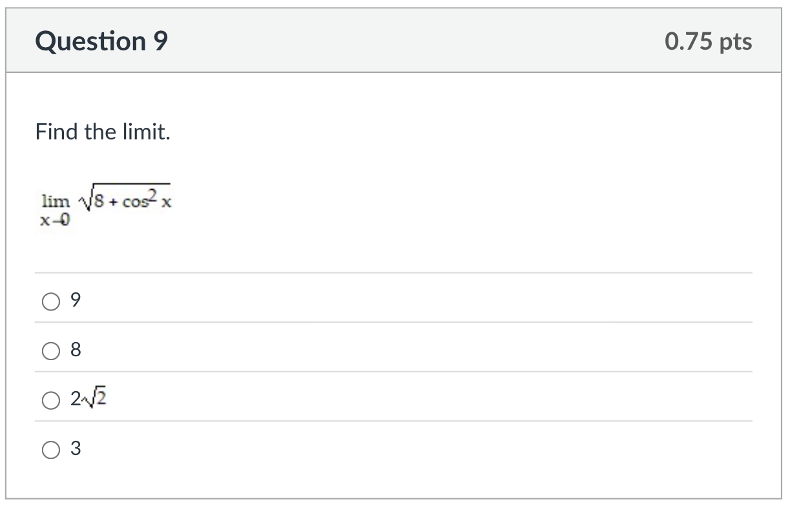
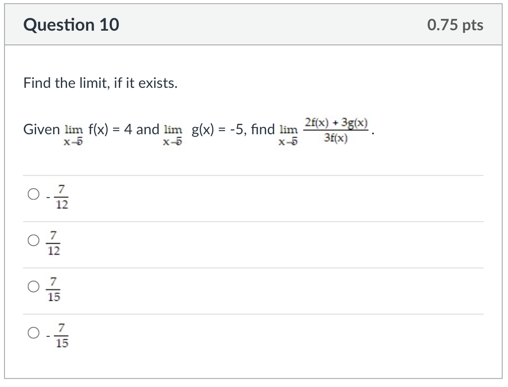

The correct answer is the second option: **The limit of f(x) as x->a from the left exists, the limit of f(x) as x->a from the right exists, and these two limits are the same.**

### Explanation

For a function $f(x)$ to have a limit as $x$ approaches a value $a$, the function must approach the **exact same value** from both the left side and the right side.

1.  **The Left-Hand Limit Must Exist:** We need to know what value the function approaches as $x$ gets closer to $a$ from values less than $a$.
    $$\lim_{x \to a^-} f(x) = L$$

2.  **The Right-Hand Limit Must Exist:** We also need to know what value the function approaches as $x$ gets closer to $a$ from values greater than $a$.
    $$\lim_{x \to a^+} f(x) = R$$

3.  **The Limits Must Be Equal:** The crucial condition is that the value approached from the left must be the same as the value approached from the right.
    $$L = R$$

If and only if these conditions are met, we can conclude that the overall limit exists. The value of the function *at* $a$, which is $f(a)$, does not need to exist or be equal to the limit for the limit itself to exist. This is why the other options are incorrect.

---

The correct answer is the second option:
* **(a) Quotient Rule**
* **(b) Difference Rule, Power Rule**
* **(c) Constant Multiple Rule and Sum Rule**

### Step-by-Step Analysis

Here's a breakdown of which limit rules were used in each step of the calculation. 📝

---

### Step (a)

The first step takes the single limit of a fraction and splits it into a fraction with a limit in the numerator and a limit in the denominator.
$$\lim_{x \to 0} \frac{N(x)}{D(x)} \quad \rightarrow \quad \frac{\lim_{x \to 0} N(x)}{\lim_{x \to 0} D(x)}$$
This is a direct application of the **Quotient Rule**.

---

### Step (b)

Two different rules are applied in this step—one to the numerator and one to the denominator.
1.  **Numerator:** The limit of a difference is rewritten as the difference of two separate limits.
    $$
    \lim_{x \to 0} (-3f(x) - 4g(x)) \quad \rightarrow \quad \lim_{x \to 0} -3f(x) - \lim_{x \to 0} 4g(x)
    $$
    This is the **Difference Rule**.
2.  **Denominator:** The limit is moved *inside* the exponent (the power of $1/2$).
    $$
    \lim_{x \to 0} (f(x) + 3)^{1/2} \quad \rightarrow \quad \left( \lim_{x \to 0} (f(x) + 3) \right)^{1/2}
    $$
    This is the **Power Rule**.

---

### Step (c)

This step also involves applying two different rules.
1.  **Numerator:** The constant coefficients ($-3$ and $4$) are pulled out in front of their respective limits.
    $$
    \lim_{x \to 0} -3f(x) - \lim_{x \to 0} 4g(x) \quad \rightarrow \quad -3\lim_{x \to 0} f(x) - 4\lim_{x \to 0} g(x)
    $$
    This uses the **Constant Multiple Rule**.
2.  **Denominator:** The limit of a sum is rewritten as the sum of two separate limits.
    $$
    \left( \lim_{x \to 0} (f(x) + 3) \right)^{1/2} \quad \rightarrow \quad \left( \lim_{x \to 0} f(x) + \lim_{x \to 0} 3 \right)^{1/2}
    $$
    This is the **Sum Rule**.

    ---

    

    The correct answer is the second option: $\frac{7}{2\sqrt{3}}$

### Explanation

This problem requires finding the limit of a function that results in an indeterminate form if you substitute the value directly. Here's how to solve it.

---

### Step 1: Direct Substitution

First, if you try plugging in $h=0$ directly into the expression, you get:
$$\frac{\sqrt{0^2 + 7(0) + 3} - \sqrt{3}}{0} = \frac{\sqrt{3} - \sqrt{3}}{0} = \frac{0}{0}$$
This is an **indeterminate form**, which is a signal that we need to simplify the expression algebraically before we can find the limit. 💡

---

### Step 2: Multiply by the Conjugate

When an expression involves a square root being added or subtracted, a common and effective technique is to multiply both the numerator and the denominator by the **conjugate**. The conjugate of $(\sqrt{A} - \sqrt{B})$ is $(\sqrt{A} + \sqrt{B})$.

In our case, the conjugate is $(\sqrt{h^2 + 7h + 3} + \sqrt{3})$.

$$\lim_{h \to 0^+} \frac{(\sqrt{h^2 + 7h + 3} - \sqrt{3})}{h} \cdot \frac{(\sqrt{h^2 + 7h + 3} + \sqrt{3})}{(\sqrt{h^2 + 7h + 3} + \sqrt{3})}$$

---

### Step 3: Simplify the Expression

When we multiply the numerators, we can use the difference of squares formula $(a-b)(a+b) = a^2 - b^2$. This removes the square roots in the numerator.
$$\lim_{h \to 0^+} \frac{(h^2 + 7h + 3) - 3}{h(\sqrt{h^2 + 7h + 3} + \sqrt{3})}$$
Simplify the numerator by combining the constant terms:
$$\lim_{h \to 0^+} \frac{h^2 + 7h}{h(\sqrt{h^2 + 7h + 3} + \sqrt{3})}$$
Now, factor out an $h$ from the numerator and cancel it with the $h$ in the denominator. This is the key step to resolving the $0/0$ form.
$$\lim_{h \to 0^+} \frac{h(h + 7)}{h(\sqrt{h^2 + 7h + 3} + \sqrt{3})} = \lim_{h \to 0^+} \frac{h + 7}{\sqrt{h^2 + 7h + 3} + \sqrt{3}}$$

---

### Step 4: Evaluate the Limit

With the expression simplified, we can now safely substitute $h=0$:
$$\frac{0 + 7}{\sqrt{0^2 + 7(0) + 3} + \sqrt{3}} = \frac{7}{\sqrt{3} + \sqrt{3}} = \frac{7}{2\sqrt{3}}$$
The limit is $\frac{7}{2\sqrt{3}}$.

---

The correct answer is the first option, which shows the function values approaching -5, so the limit is -5.0.

### Explanation

The goal is to estimate the limit by observing the behavior of $f(x) = x^2 - 5$ as $x$ gets closer and closer to 0. We do this by calculating the function's value for each $x$ provided in the table.

---

### Step 1: Calculate f(x) for x < 0 (Approaching from the left)

We plug the negative values of $x$ into the function.

* When $x = -0.1$:
    $f(-0.1) = (-0.1)^2 - 5 = 0.01 - 5 = -4.99$
* When $x = -0.01$:
    $f(-0.01) = (-0.01)^2 - 5 = 0.0001 - 5 = -4.9999$
* When $x = -0.001$:
    $f(-0.001) = (-0.001)^2 - 5 = 0.000001 - 5 = -4.999999$

As $x$ approaches 0 from the left side, the value of $f(x)$ gets closer to -5.

---

### Step 2: Calculate f(x) for x > 0 (Approaching from the right)

Now we plug the positive values of $x$ into the function.

* When $x = 0.1$:
    $f(0.1) = (0.1)^2 - 5 = 0.01 - 5 = -4.99$
* When $x = 0.01$:
    $f(0.01) = (0.01)^2 - 5 = 0.0001 - 5 = -4.9999$
* When $x = 0.001$:
    $f(0.001) = (0.001)^2 - 5 = 0.000001 - 5 = -4.999999$

As $x$ approaches 0 from the right side, the value of $f(x)$ also gets closer to -5.

---

### Step 3: Conclude the Limit

Based on our calculations, the completed table of values is:

| x      | -0.1    | -0.01     | -0.001      | 0.001       | 0.01      | 0.1     |
| :---   | :---    | :---      | :---        | :---        | :---      | :---    |
| f(x)   | -4.99   | -4.9999   | -4.999999   | -4.999999   | -4.9999   | -4.99   |

Since the function approaches the same value (-5) from both the left and the right, we can confidently estimate that the limit is **-5**. The first option in the question correctly identifies this limit and shows the corresponding function values.

*(**Note:** Since $f(x)=x^2-5$ is a polynomial, it is continuous everywhere. Therefore, the limit can also be found by **direct substitution**: $\lim_{x \to 0} (x^2 - 5) = (0)^2 - 5 = -5$.)*

---

The correct answer is the third option: **Does not exist**.

### Explanation

To find this limit, we'll start with direct substitution and then analyze the behavior of the function from the left and right sides of 0.

---

### Step 1: Direct Substitution

First, let's try substituting $x=0$ into the function:
$$\frac{(0)^2 - 6(0) + 5}{(0)^3 - 0} = \frac{5}{0}$$
When we get a non-zero number divided by zero, this indicates there is a **vertical asymptote** at $x=0$. The limit will be either $\infty$, $-\infty$, or it might not exist if the function behaves differently on either side of the asymptote. To find out, we must check the one-sided limits. 🧐

---

### Step 2: Analyze the Left-Hand Limit ($x \to 0^-$)

Let's see what happens as $x$ approaches 0 from the left (i.e., with small negative numbers like $x = -0.01$).

* **Numerator:** $x^2 - 6x + 5$ approaches $5$ (a **positive** number).
* **Denominator:** $x^3 - x = x(x^2 - 1)$. For a small negative $x$, $x$ is negative and $(x^2 - 1)$ is negative (close to -1). So, the denominator is (negative) $\times$ (negative) = **positive**.

Since we have a positive numerator and a tiny positive denominator, the fraction becomes a very large positive number.
$$\lim_{x \to 0^-} \frac{x^2 - 6x + 5}{x^3 - x} = \frac{+5}{0^+} = +\infty$$

---

### Step 3: Analyze the Right-Hand Limit ($x \to 0^+$)

Now, let's see what happens as $x$ approaches 0 from the right (i.e., with small positive numbers like $x = 0.01$).

* **Numerator:** $x^2 - 6x + 5$ still approaches $5$ (a **positive** number).
* **Denominator:** $x^3 - x = x(x^2 - 1)$. For a small positive $x$, $x$ is positive and $(x^2-1)$ is negative (close to -1). So, the denominator is (positive) $\times$ (negative) = **negative**.

Since we have a positive numerator and a tiny negative denominator, the fraction becomes a very large negative number.
$$\lim_{x \to 0^+} \frac{x^2 - 6x + 5}{x^3 - x} = \frac{+5}{0^-} = -\infty$$

---

### Step 4: Conclusion

The left-hand limit and the right-hand limit are not the same:
$$\lim_{x \to 0^-} f(x) = +\infty \quad \text{and} \quad \lim_{x \to 0^+} f(x) = -\infty$$
Because the function approaches two different "values" from the left and the right, the overall two-sided limit **does not exist**.

---

The correct answer is the last option: **0**.

### Explanation

This limit involves a trigonometric function that oscillates divided by a variable that goes to infinity. This is a classic case for using the **Squeeze Theorem** (also known as the Sandwich Theorem). 🥪

---

### Step 1: Bound the Numerator

The first step is to recognize that the cosine function, `cos(5x)`, always outputs a value between -1 and 1, no matter what `x` is. We can write this as an inequality:
$$-1 \le \cos(5x) \le 1$$

---

### Step 2: Construct the Squeeze

Now, we can divide every part of the inequality by `x`. Since we are considering the limit as $x \to \infty$, we know that $x$ is positive, so the inequality signs don't flip.
$$\frac{-1}{x} \le \frac{\cos(5x)}{x} \le \frac{1}{x}$$
This inequality shows that our function, $\frac{\cos(5x)}{x}$, is "squeezed" between two other functions: $\frac{-1}{x}$ and $\frac{1}{x}$.

---

### Step 3: Find the Limits of the Outer Functions

Next, we find the limits of the two outer functions as $x$ approaches infinity. As a number in the denominator gets infinitely large, the fraction itself approaches zero.
* **Lower Bound:**
    $$\lim_{x \to \infty} \frac{-1}{x} = 0$$
* **Upper Bound:**
    $$\lim_{x \to \infty} \frac{1}{x} = 0$$
Both the lower and upper bounds go to 0.

---

### Step 4: Apply the Squeeze Theorem

The Squeeze Theorem states that if a function is trapped between two other functions that are heading to the same limit, then the function in the middle must also go to that same limit.

Since $\frac{\cos(5x)}{x}$ is squeezed between two functions that both approach 0, our limit must also be 0.
$$\lim_{x \to \infty} \frac{\cos(5x)}{x} = 0$$

---

The correct answer is the third option: **4**.

### Explanation

This limit problem results in an indeterminate form upon first inspection, which can be resolved by factoring and simplifying the expression.

---

### Step 1: Direct Substitution

As always, the first step is to try substituting the value $x=4$ directly into the expression.
* **Numerator:** $(4)^2 - 16 = 16 - 16 = 0$
* **Denominator:** $(4)^2 - 6(4) + 8 = 16 - 24 + 8 = 0$

This gives us the indeterminate form $\frac{0}{0}$. This is a good sign! It means the numerator and denominator share a common factor, and we can simplify the fraction to find the limit. ✅

---

### Step 2: Factor the Numerator and Denominator

Now, let's factor both the top and bottom expressions.

* **Numerator ($x^2 - 16$):** This is a classic **difference of squares**, which factors into $(a-b)(a+b)$.
    $$x^2 - 16 = (x-4)(x+4)$$
* **Denominator ($x^2 - 6x + 8$):** We need to find two numbers that multiply to 8 and add to -6. Those numbers are -4 and -2.
    $$x^2 - 6x + 8 = (x-4)(x-2)$$

---

### Step 3: Simplify and Evaluate the Limit

Now we can rewrite the limit with the factored forms and cancel the common factor of $(x-4)$.
$$\lim_{x \to 4} \frac{(x-4)(x+4)}{(x-4)(x-2)}$$After canceling, we are left with a much simpler expression:$$\lim_{x \to 4} \frac{x+4}{x-2}$$Now, we can substitute $x=4$ into the simplified expression:$$\frac{4+4}{4-2} = \frac{8}{2} = 4$$
The limit is **4**.

---

The correct answer is the third option: $-\infty$.

### Explanation

This question asks for a one-sided limit of the tangent function as it approaches one of its vertical asymptotes. We can solve this by analyzing the definition of tangent, $\tan(x) = \frac{\sin(x)}{\cos(x)}$.

---

### Step 1: Analyze the Numerator and Denominator

We need to see what happens to $\sin(x)$ and $\cos(x)$ as $x$ approaches $\pi/2$ from the **right side** (indicated by the $+$ superscript).

1.  **Numerator ($\sin x$):**
    As $x$ gets very close to $\pi/2$ (from either side), the value of $\sin(x)$ gets very close to $\sin(\pi/2)$, which is **1**.
    $$\lim_{x \to (\pi/2)^+} \sin x = 1$$

2.  **Denominator ($\cos x$):**
    As $x$ approaches $\pi/2$ from the right, we are looking at angles slightly *larger* than $90^\circ$. These angles are in the **second quadrant** of the unit circle. In the second quadrant, the value of cosine is **negative**.
    So, as $x$ gets very close to $\pi/2$ from the right, $\cos(x)$ approaches 0, but it does so with small negative values. We can write this as approaching $0^-$.
    $$\lim_{x \to (\pi/2)^+} \cos x = 0^-$$

---

### Step 2: Combine the Results

Now we can evaluate the limit of the fraction:
$$\lim_{x \to (\pi/2)^+} \tan x = \frac{\lim_{x \to (\pi/2)^+} \sin x}{\lim_{x \to (\pi/2)^+} \cos x} = \frac{1}{0^-}$$
A positive number (1) divided by a very small negative number results in a very large negative number. 📉
Therefore, the limit is $-\infty$.

### Visual Confirmation
If you picture the graph of $y = \tan(x)$, you'll see it has a vertical asymptote at $x = \pi/2$. To the right of this line, the curve comes up from negative infinity, confirming our answer.

---

The correct answer is the last option: **3**.

### Explanation

This limit can be found using **direct substitution**. This is possible because the function is built from operations (square root, addition) and functions ($\cos x$, squaring) that are all **continuous** at the point we are approaching, $x=0$.

---

### Step 1: Apply Direct Substitution

Because the function is continuous, we can find the limit by simply plugging the value $x=0$ directly into the expression.
$$\lim_{x \to 0} \sqrt{8 + \cos^2 x} = \sqrt{8 + \cos^2(0)}$$

---

### Step 2: Evaluate the Expression

We know that the value of $\cos(0)$ is **1**.
$$\cos(0) = 1$$So, $\cos^2(0) = (1)^2 = 1$. Now, substitute this back into our expression:$$\sqrt{8 + 1}$$

---

### Step 3: Final Calculation

Simplify the expression under the square root to get the final answer.
$$\sqrt{9} = 3$$
The limit is **3**. ✨

The correct answer is the first option: $-\frac{7}{12}$.

### Explanation

This problem is a direct application of the **Limit Laws**. Since we are given the individual limits of $f(x)$ and $g(x)$, we can use the properties of limits to solve for the combined expression by simply substituting the given values.

---

### Step 1: Apply the Limit Laws

We can break down the limit of the complex fraction using the **Quotient Rule**, **Sum Rule**, and **Constant Multiple Rule** all at once.
$$\lim_{x \to 5} \frac{2f(x) + 3g(x)}{3f(x)} = \frac{2 \cdot \lim_{x \to 5} f(x) + 3 \cdot \lim_{x \to 5} g(x)}{3 \cdot \lim_{x \to 5} f(x)}$$

---

### Step 2: Substitute the Given Values

The problem states that:
* $\lim_{x \to 5} f(x) = 4$
* $\lim_{x \to 5} g(x) = -5$

Now we can plug these numbers directly into our expression:
$$\frac{2 \cdot (4) + 3 \cdot (-5)}{3 \cdot (4)}$$

---

### Step 3: Calculate the Result

Finally, perform the arithmetic to find the answer.
$$\frac{8 - 15}{12} = \frac{-7}{12}$$
The limit is **$-\frac{7}{12}$**.