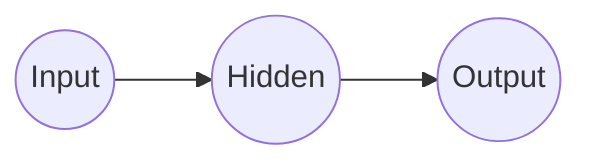
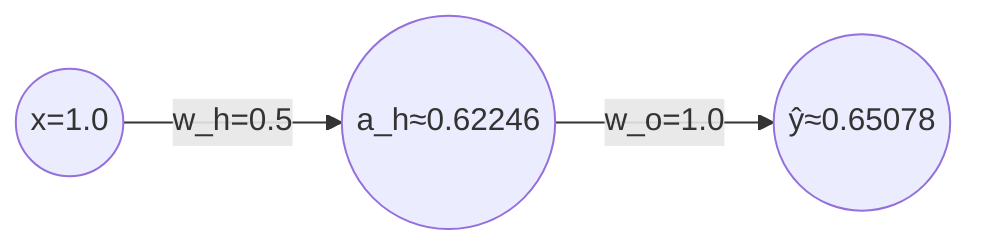
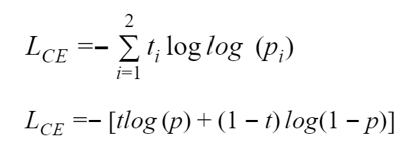
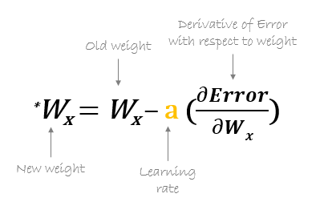

One feature input: $x = 1.0$
Hidden neuron with weight: $w_h = 0.5$
Output neuron with weight: $w_o = 1.0$

Target label: $y = 1$

Biases: $0$

Sigmoid Activation Function: $\sigma(x)$
$$
\sigma(x) = \frac{1}{1 + e^{-x}}
$$

Loss function: **binary cross-entropy**
$$
L(y,\hat{y}) = -[y \log(\hat{y}) + (1 - y) \log(1 - \hat{y})]
$$

Learning Rate: $\alpha = 0.1$

---

The hidden neuron takes the input x, then it multiplies it by it's weight, $w_h = 0.5$, which gives us the hidden neuron's pre-activation, $z_h$, then we'll apply our sigmoid activation to the value, giving us the neuron's output, $a_h$

$$
z_h = w_h \cdot x \qquad a_h = \sigma(z_h)
$$

Pre-activation,
$$
\begin{array}{l}
  z_h = 0.5 \cdot 1.0 \\
  z_h = 0.5
\end{array}
$$

Output,
$$
\begin{aligned}
  a_h &= \sigma(0.5) \\[0.2em]
  a_h &= \frac{1}{1 + e^{-0.5}} \\[1em]
  a_h &= \frac{1}{1 + 2.71828^{-0.5}} \\[1em]
  a_h &= 0.62246
\end{aligned}
$$

The output neuron takes the input $a_h$, the output from our hidden neuron, then it multiplies it by it's weight, $w_o = 1.0$, which gives us the output neuron's pre-activation, $z_o$, then we'll apply our sigmoid activation to the value, giving us the output neuron's output, $\hat{y}$

$$
z_o = w_o \cdot a_h \qquad \hat{y} = \sigma(z_o)
$$

Pre-activation,
$$
\begin{array}{l}
  z_o = 1.0 \cdot 0.62246 \\
  z_o = 0.62246
\end{array}
$$

Output,
$$
\begin{aligned}
  \hat{y} &= \sigma(0.62246) \\[0.2em]
  \hat{y} &= \frac{1}{1 + e^{-0.62246}} \\[1em]
  \hat{y} &= \frac{1}{1 + 2.71828^{-0.62246}} \\[1em]
  \hat{y} &= 0.65078
\end{aligned}
$$

---

Now to compute the loss and measure how wrong our prediction, $\hat{y}$ was compared to our target label, $y$, we'll use the **binary cross entropy** loss function, for the logarithms use in **bce**, remember to use the natural log, $e$, instead of base 10 as used by default in calculators,
https://www.calculator.net/log-calculator.html?xv=0.65078&base=e&yv=&x=Calculate

$$
L(y,\hat{y}) = -[y \log(\hat{y}) + (1 - y) \log(1 - \hat{y})]
$$

Remember,

$$
\hat{y} = 0.65078 \qquad y = 1
$$

so,

$$
\begin{aligned}
  L(1, 0.65078) = -[1 \cdot \log(0.65078) + (1 - 1) \cdot \log(1 - 0.65078)] \\[1em]
  L(1, 0.65078) = -[1 \cdot \log(0.65078) + (0) \cdot \log(0.34922)] \\[1em]
  L(1, 0.65078) = -[-0.42958 + 0] \\[1em]
  L(1, 0.65078) = -[-0.42958] \\[1em]
  L(1, 0.65078) = 0.42958
\end{aligned}
$$

---

Now that we have our loss, $L = 0.42958$, we need to know how to change the weights to make the loss smaller. For this we use **gradients**, which are the derivatives of the loss with respect to each weight. They tell us if we should increase or decrease a weight, and how strongly a weight affects the loss.

To move backwards through our network and see how much each weight contributed to the error, we'll use the chain rule,

Since the output neuron's output is, $\hat{y} = \sigma(z_o)$, and the loss depends on $\hat{y}$, if we want to see how the loss changes with respect to $z_o$, we need

$$\frac{\partial L}{\partial z_o}$$

which is calculated using the derivative of our loss with respect to our output and the derivative of our output with respect to our neuron's pre-activation,

$$
\frac{\partial L}{\partial z_o} = \frac{\partial L}{\partial \hat{y}} \cdot \frac{\partial \hat{y}}{\partial z_o}
$$

which simplifies to,

$$\frac{\partial L}{\partial z_o} = \hat{y} - y$$

$$\frac{\partial L}{\partial z_o} = 0.65078 - 1$$

$$\frac{\partial L}{\partial z_o} = -0.34922$$

So if we increase $z_o$, the loss decreases.
\
\
And to know how much the output weight contributed the loss / the gradient for $w_o$,

$$
\frac{\partial L}{\partial w_o} = \frac{\partial L}{\partial z_o} \cdot \frac{\partial z_o}{\partial w_o}
$$

And since we know,

$$z_o = w_o \cdot a_h$$

We can simplify,

$$\frac{\partial z_o}{\partial w_o} = a_o$$

As such, we know the values are,

$$
\begin{aligned}
  \frac{\partial L}{\partial w_o} = −0.34922 \cdot 0.62246 \\[1em]
  \frac{\partial L}{\partial w_o} = -0.21737
\end{aligned}
$$

So if we increase $w_o$, the loss decreases.
\
\
Then we keep propagating this error backwards through our neural network, and at our hidden layer we look for the gradient with respect to the hidden neuron activation,

$$
\frac{\partial L}{\partial a_h} = \frac{\partial L}{\partial z_o} \cdot \frac{\partial z_o}{\partial a_h}
$$

And since we know,

$$z_o = w_o \cdot a_h$$

We can simplify,

$$\frac{\partial z_o}{\partial a_h} = w_o$$

As such, we know the values are,

$$
\begin{aligned}
  \frac{\partial L}{\partial a_o} = −0.34922 \cdot 1.0 \\[1em]
  \frac{\partial L}{\partial a_o} = -0.34922
\end{aligned}
$$

So if $a_h$ is larger, the loss is smaller.
\
\
And now to know how much the hidden weight contributed to the loss / the gradient for $w_h$,

$$
\frac{\partial L}{\partial w_h} = \frac{\partial L}{\partial a_h} \cdot \frac{\partial a_h}{\partial z_h} \cdot \frac{\partial z_h}{\partial w_h}
$$

And since we know,

$$z_h = w_h \cdot x$$

We can simplify,

$$\frac{\partial z_h}{\partial w_h} = x$$

And recall,

$$ a_h = \sigma(z_h) $$

So,

$$
\begin{aligned}
  \frac{\partial a_h}{\partial z_h} = a_h(1 - a_h)
  \\[1em]
  \frac{\partial a_h}{\partial z_h} = 0.62246(1 - 0.62246) \\[1em]
  \frac{\partial a_h}{\partial z_h} = 0.23500
\end{aligned}
$$

As such, we know the values are,

$$
\begin{aligned}
  \frac{\partial L}{\partial w_h} = −0.34922 \cdot 0.23500 \cdot 1.0 \\[1em]
  \frac{\partial L}{\partial w_h} = -0.08206
\end{aligned}
$$

So if we increase $w_h$, the loss decreases, not as much as $w_o$ though.

---

Now that we have our gradients, we can use gradient descent to update each weight and reduce the error,

$$
w_x = w_x - \alpha\frac{\partial L}{\partial w_x}
$$

Recall, that $w_x$ is some weight, $\alpha$ is our learning rate, and $\alpha\frac{\partial L}{\partial w_x}$ is our gradient of the loss with respect to $w_x$

Now, let's update $w_o$,
\
$ w_o = 1.0 \qquad \alpha = 0.1 \qquad \frac{\partial L}{\partial w_o} = -0.21737 $
\
So,

$$
\begin{array}{l}
  w_o = 1.0 - 0.1(-0.21737) \\
  w_o = 1.0 - -0.02174 \\
  w_o = 1.0 + 0.02174 \\
  w_o = 1.02174
\end{array}
$$

And finally, $w_h$,
\
$ w_h = 0.5 \qquad \alpha = 0.1 \qquad \frac{\partial L}{\partial w_h} = -0.08206 $
\
So,

$$
\begin{array}{l}
  w_h = 0.5 - 0.1(-0.08206) \\
  w_h = 0.5 - -0.00821 \\
  w_h = 0.5 + 0.00821 \\
  w_h = 0.50821
\end{array}
$$